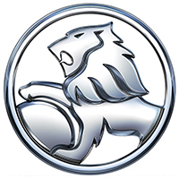
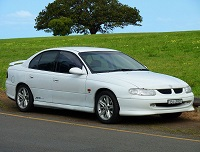

# Holden 
The aussie car company

## About Holden

*The Holden logo*

**Holden**, formerly known as General Motors-Holden, is an Australian automobile brand and former automobile manufacturer, which imports manufactured cars under the Holden brand. It is headquartered in Port Melbourne, Victoria. The company was founded in 1856 as a saddlery manufacturer in South Australia. In 1908, it moved into the automotive field, becoming a subsidiary of the United States-based General Motors (GM) in 1931, when the company was renamed General Motors-Holden's Ltd. It was renamed Holden Ltd in 1998, and General Motors-Holden in 2005.

In the past, Holden has offered badge-engineered models due to sharing arrangements with Chevrolet, Isuzu, Nissan, Opel, Suzuki, Toyota, and Vauxhall Motors. In previous years, the vehicle lineup consisted of models from GM Korea, GM Thailand, GM North America, and self-developed models like the Holden Commodore, Holden Caprice, and the Holden Ute. Holden also distributed the European Opel brand in Australia in 2012 until its Australian demise in mid-2013, and briefly the American Cadillac brand in 2009 until the brand's full launch was delayed indefinitely. Holden also operated assembly plants in New Zealand from 1926 until 1990 by General Motors New Zealand Limited in an earlier and quite separate operation from Holden in Australia.

From 1994 to 2017, all Australian-built Holden vehicles were manufactured in Elizabeth, South Australia, and engines were produced at the Fishermans Bend plant in Melbourne. Historically, production or assembly plants were operated in all mainland states of Australia. The consolidation of final assembly at Elizabeth was completed in 1988, but some assembly operations continued at Dandenong until 1994. Although Holden's involvement in exports has fluctuated since the 1950s, the declining sales of large cars in Australia led the company to look to international markets to increase profitability. From 2010 onwards, Holden incurred losses due to the strong Australian dollar, and reductions of government grants and subsidies. This led to the announcement on 11 December 2013 that Holden would cease vehicle and engine production by the end of 2017. On 20 October 2017, the last existing vehicle plant located in Elizabeth was closed as the production of the Holden Commodore ended. Holden continues solely as an importer of vehicles.

## Early History

In 1852, James Alexander Holden emigrated to South Australia from Walsall, England, and in 1856 established J.A. Holden & Co., a saddlery business in Adelaide. In 1879 J A Holden’s eldest son Henry James (HJ) Holden, became a partner and effectively managed the company. In 1885, German-born H. A. Frost joined the business as a junior partner and J.A. Holden & Co became Holden & Frost Ltd. Edward Holden, James' grandson, joined the firm in 1905 with an interest in automobiles. From there, the firm evolved through various partnerships, and in 1908, Holden & Frost moved into the business of minor repairs to car upholstery. The company began to re-body older chassis using motor bodies produced by F T Hack and Co from 1914. Holden & Frost mounted the body, and painted and trimmed it. The company began to produce complete motorcycle sidecar bodies after 1913. After 1917, wartime trade restrictions led the company to start full-scale production of vehicle body shells. H.J. Holden founded a new company in late 1917, and registered Holden's Motor Body Builders Ltd (HMBB) on 25 February 1919, specializing in car bodies and using the former F T Hack & Co facility at 400 King William Street in Adelaide before erecting a large four-story factory on the site.

By 1923, HMBB were producing 12,000 units per year. During this time, HMBB assembled bodies for Ford Motor Company of Australia until its Geelong plant was completed. From 1924, HMBB became the exclusive supplier of car bodies for GM in Australia, with manufacturing taking place at the new Woodville plant. These bodies were made to suit a number of chassis imported from manufacturers including Austin, Buick, Chevrolet, Cleveland, Dodge, Essex, Fiat, Hudson, Oakland, Oldsmobile, Overland, Reo, Studebaker, and Willys Knight.

In 1926, General Motors (Australia) Limited was established with assembly plants at Newstead, Queensland; Marrickville, New South Wales; City Road, Melbourne; Birkenhead, South Australia; and Cottesloe, Western Australia using bodies produced by HMBB and imported complete knock down chassis. In 1930 alone, the still independent Woodville plant built bodies for Austin, Chrysler, DeSoto, Morris, Hillman, Humber, Hupmobile, and Willys-Overland, as well GM cars. The last of this line of business was the assembly of Hillman Minx sedans in 1948. The Great Depression led to a substantial downturn in production by Holden, from 34,000 units annually in 1930 to just 1,651 units one year later. In 1931, GM purchased HMBB and merged it with General Motors (Australia) Pty Ltd to form General Motors-Holden's Ltd (GM-H). Throughout the 1920s, Holden also supplied tramcars to the Melbourne & Metropolitan Tramways Board, of which several examples have been preserved in both Australia and New Zealand.     

## Exports
       

*The Holden Commodore*
        
*Holden* began to export vehicles in 1954, sending the FJ to New Zealand. Exports to New Zealand continued, but to broaden their export potential, Holden began to cater their Commodore, Monaro and Statesman/Caprice models for both right- and left-hand drive markets. The Middle East was Holden's largest export market, with the Commodore sold as the Chevrolet Lumina from 1998, and the Statesman from 1999 as the Chevrolet Caprice. Commodores were also sold as the Chevrolet Lumina in Brunei, Fiji and South Africa, and as the Chevrolet Omega in Brazil. Pontiac in North America also imported Commodore sedans from 2008 through to 2009 as the G8. The G8's cessation was a consequence of GM's Chapter 11 bankruptcy resulting in the demise of the Pontiac brand.

Sales of the Monaro began in 2003 to the Middle East as the Chevrolet Lumina Coupe. Later that year a modified version of the Monaro began selling in the United States (but not in Canada) as the Pontiac GTO, and under the Monaro name through Vauxhall dealerships in the United Kingdom. This arrangement continued through to 2005 when the car was discontinued. The long-wheelbase Statesman sales in the Chinese market as the Buick Royaum began in 2005, before being replaced in 2007 by the Statesman-based Buick Park Avenue. Statesman/Caprice exports to South Korea also began in 2005. These Korean models were sold as the Daewoo Statesman, and later as the Daewoo Veritas from 2008. Holden's move into international markets proved profitable; export revenue increased from A$973 million in 1999 to just under $1.3 billion in 2006.

From 2011 the WM Caprice was exported to North America as the Chevrolet Caprice PPV, a version of the Caprice built exclusively for law enforcement in North America and sold only to police. From 2007 the HSV-based Commodore was exported to the United Kingdom as the Vauxhall VXR8. In 2013 Chevrolet announced that exports of the Commodore would resume to North America in the form of the VF Commodore as the Chevrolet SS sedan for the 2014 model year. The Chevrolet SS Sedan was also imported to the United States (but again, not to Canada) for 2015 with only minor changes, notably the addition of Magnetic Ride Control suspension and a Tremec TR-6060 manual transmission. For the 2016 model year the SS sedan received a facelift based on the VF Series II Commodore unveiled in September 2015. In 2017, production of Holden's last two American exports, the SS and the Caprice PPV was discontinued.

> ## Vehicles
>
> ### Current Models            
> - Commodore
> - Astra
> - Trax
> - Trailblazer
> - Equinox
> - Acadia
> - Colorado
> - Spark
>            
> ### Former Models
> - Monaro
> - Camira
> - Torana
> - Adventura
> - One Tonner
> - Kingswood
> - Brougham
> - Special

## Citations
- Davis, Tony; Kennedy, Alistair; Kennedy, Ewan (February 2007), [The Holden Heritage](https://web.archive.org/web/20070926214934/http://media.gmcanada.com:8221/aus/holden/en/company/history/HH13Part1.pdf) – 13th Edition, Port Melbourne, Victoria: GM Holden.
- Mendelssohn, Joanna (28 June 2017), [Celebrating the Feminist Holden](https://theconversation.com/celebrating-the-feminist-holden-80054)
- Wagner, David Paul, [Canowindra Motors Holden Museum](https://www.australiaforvisitors.com/canowindra-motors-holden-museum.html)

## Source
From Wikipedia: [Holden](https://en.wikipedia.org/wiki/holden). 
This webpage, by Jaafar Al Hadab